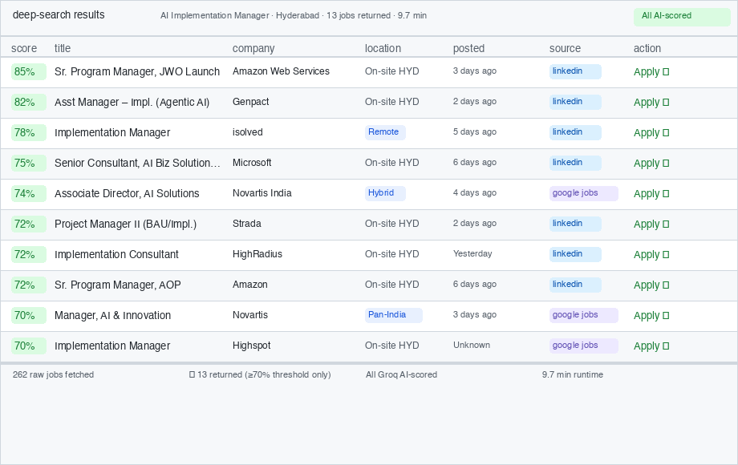

# job-finder-ai

[](https://github.com/harshgarg95/job-finder-ai/actions/workflows/health.yml)

AI-powered job search tool for the **India market**. Searches LinkedIn, Indeed,
and Naukri simultaneously, deduplicates results, scores every job against your
resume with a Groq LLM, and filters out role mismatches before you ever see them.

## Sample output



---

## Feature overview

| Feature | This tool | Manual job search |
|---------|-----------|-------------------|
| LinkedIn + Indeed + Naukri in one call | ✅ parallel, ~60 s | Search each site separately |
| AI match score (0-100) per job | ✅ Groq LLM, free | None |
| Role-mismatch filter (wrong level/domain) | ✅ auto-detected | None |
| Career-switch weight adjustment | ✅ automatic | None |
| Progressive date window (24 h → 3 d → 7 d) | ✅ stops when enough found | Not applicable |
| Duplicate removal across platforms | ✅ MD5 dedup | Manual |
| Link liveness check | ✅ parallel HEAD checks | None |
| SQLite trend tracking across runs | ✅ scrutinizer.db | None |
| Multiple Groq API keys (rotation) | ✅ up to 5 keys | Not applicable |
| Zero platform API keys for LinkedIn/Indeed | ✅ python-jobspy | LinkedIn API costs $99+/mo |

---

## Quick Start

**Step 1: Clone and install**
```bash
git clone https://github.com/harshgarg020695-glitch/job-finder-ai
cd job-finder-ai
pip install -r requirements.txt
```

**Step 2: Guided setup** (gets your API keys, validates them, runs a test search)
```bash
python setup.py
```

**Step 3: Start searching**
```bash
python api.py          # starts server at localhost:8000
```
Then in a new terminal:
```bash
# Quick search (~3 min)
curl -X POST http://localhost:8000/api/search \
  -H "Content-Type: application/json" \
  -d '{"keyword": "Product Manager", "location": "Hyderabad", "resume": "paste resume text here"}'

# Deep search with AI scoring (~10 min, better results)
curl -X POST http://localhost:8000/api/deep-search \
  -H "Content-Type: application/json" \
  -d '{"keyword": "Product Manager", "location": "Hyderabad", "resume": "paste resume text here"}'
```

Results are returned as JSON. Save to CSV:
```bash
curl ... | python3 -c "import sys,json,csv; jobs=json.load(sys.stdin)['jobs']; ..."
```---

## API keys

| Key | Used for | Free tier | Get it |
|-----|----------|-----------|--------|
| `GROQ_API_KEY` | AI scoring | 14,400 req/day | [console.groq.com/keys](https://console.groq.com/keys) |
| `SERPER_API_KEY` | Naukri search (primary) | 2,500/month | [serper.dev](https://serper.dev) |
| `SERPAPI_KEY` | Naukri fallback | 100/month | [serpapi.com](https://serpapi.com/manage-api-key) |

**LinkedIn and Indeed need zero API keys** — python-jobspy scrapes them directly.

### Multiple Groq keys (multiply free quota)

Add up to 5 keys to `.env` for automatic round-robin rotation:

```
GROQ_API_KEY=gsk_primary…
GROQ_API_KEY_1=gsk_key2…
GROQ_API_KEY_2=gsk_key3…
```

Each free key adds 14,400 AI scoring calls/day. On a 429 the exhausted key is
cooled off for 65 s and the next key is tried automatically.

---

## Daily limits at a glance

| Resource | Free allowance | What happens when hit |
|----------|---------------|----------------------|
| Groq requests | 14,400/day/key | Falls back to keyword-only scoring (score = 0–50 range) |
| Serper searches | 2,500/month | Falls back to SerpAPI |
| SerpAPI searches | 100/month | Naukri results unavailable; LinkedIn/Indeed unaffected |
| LinkedIn/Indeed | Unlimited* | *JobSpy may occasionally be rate-limited by the platform |

---

## API reference

### `POST /api/deep-search` — full pipeline (recommended)

Runs progressive window search (24 h → 3 d → 7 d), AI scoring, role filtering,
and link checking.

```json
{
  "keyword":  "AI Implementation Manager",
  "location": "Hyderabad, India",
  "resume":   "Full resume text…",
  "target":   50,
  "platforms": ["linkedin", "indeed", "naukri"]
}
```

### `POST /api/search` — single-window search

```json
{
  "keyword":              "product manager",
  "location":             "Hyderabad, India",
  "platforms":            ["linkedin", "indeed", "naukri"],
  "max_per_platform":     20,
  "hours_old":            72,
  "score_against_resume": true,
  "resume":               "Resume text…"
}
```

Response shape:

```json
{
  "jobs": [
    {
      "title": "Senior AI Manager", "company": "Accenture",
      "location": "Hyderabad", "source": "linkedin",
      "score": 84, "score_reason": "Strong AI delivery + stakeholder management overlap",
      "scored_by": "groq_ai", "freshness_label": "Today",
      "description_quality": "complete", "link_status": "live",
      "url": "https://…"
    }
  ],
  "total": 31,
  "by_platform": {"linkedin": 14, "indeed": 10, "naukri": 7}
}
```

### `POST /api/parse-resume` — extract text from PDF/DOCX

```bash
curl -X POST http://localhost:8000/api/parse-resume \
  -F "file=@/path/to/resume.pdf"
```

### `GET /api/health` — system health check

Returns Groq quota, key status, and platform availability.

### `GET /api/search-progress/<session_id>` — live progress (SSE)

Server-Sent Events stream for long-running deep searches. Each event is a
plain-text log line from the search pipeline.

---

## Monitoring

```bash
# Full evaluation across all checks (9–12 min)
python scrutinizer.py

# Quick check — skips link verification (2–3 min)
python scrutinizer.py --quick

# Historical trend report (no new search)
python scrutinizer.py --report-only

# Specific scenario
python scrutinizer.py --quick --scenario developer
python scrutinizer.py --quick --scenario remote
python scrutinizer.py --quick --scenario junior
```

The scrutinizer runs 7 checks:

1. Backend health (`/api/health`)
2. Groq API quota
3. Scraper health (platform reachability)
4. Live test search
5. Output quality (score distribution, description quality)
6. Link liveness (skipped with `--quick`)
7. Metrics saved to `scrutinizer.db`

Results are stored in `scrutinizer.db` (SQLite). View trends:

```bash
python scrutinizer.py --report-only
```

---

## Architecture

```
job-finder-ai/
├── api.py                        # Flask REST API
├── setup.py                      # First-run wizard
├── scrutinizer.py                # Health + quality evaluator
├── groq_analyzer.py              # Groq LLM scoring (batch + premium)
├── hybrid_scorer.py              # Keyword × context blending + role filter
├── keyword_matcher.py            # Skill overlap scoring
├── job_automation/
│   ├── aggregator.py             # Parallel fan-out + dedup + progressive window
│   ├── job_scraper.py            # JobSpy (LinkedIn + Indeed)
│   ├── naukri_scraper.py         # Serper/SerpAPI (Naukri via Google)
│   ├── groq_key_manager.py       # Multi-key rotation on 429
│   ├── link_checker.py           # Parallel HEAD-based liveness checks
│   └── metrics_db.py             # SQLite run + job metrics storage
├── serper_job_finder.py          # Serper search wrapper
├── platform_filter.py            # Trusted/blocked URL allowlist
└── keyword_matcher.py            # Keyword overlap scoring
```

### Scoring pipeline

```
Job listing
    │
    ├─► KeywordMatcher   → keyword_score  (0-100, skill overlap)
    │
    ├─► GroqAnalyzer     → context_score  (0-100, domain + transferability)
    │       └── score_batch()  — up to 5 jobs per LLM call
    │
    ├─► HybridScorer     → weighted blend
    │       └── auto-detects career switch → adjusts weights
    │           same domain    50 / 50
    │           switch-High    60 / 40
    │           switch-Medium  70 / 30
    │           switch-Low     80 / 20
    │
    └─► role_mismatch_penalty()
            wrong level/domain → cap at 35
```

---

## Platform status (May 2026)

| Platform | Method | Key required |
|----------|--------|-------------|
| LinkedIn | python-jobspy (scraping) | None |
| Indeed | python-jobspy (scraping) | None |
| Naukri | Serper → SerpAPI fallback (Google) | `SERPER_API_KEY` |

---

## Improving Results Over Time

The app learns from your usage. When you apply to or skip jobs, record the action:

```bash
curl -X POST http://localhost:8000/api/record-action \
  -H "Content-Type: application/json" \
  -d '{
    "run_id": 7,
    "url": "https://linkedin.com/jobs/view/1234567890",
    "score": 78,
    "domain_match": "strong",
    "source": "linkedin",
    "posted": "2026-05-18",
    "action": "applied"
  }'
```

Valid actions: `applied` | `skipped` | `saved` | `opened_url`

After 20+ actions, check calibration insights:

```bash
curl http://localhost:8000/api/calibration-insights
```

This returns the score thresholds where you actually apply, and whether the
`strong`/`moderate`/`weak` domain labels are predicting your behaviour correctly.
All data stays local in `feedback.db`.

---

## Privacy

- All data (resume, jobs, feedback) stays on your machine by default
- Resume text is never transmitted anywhere
- Job URLs are stored as one-way SHA-256 hashes — originals cannot be recovered
- `feedback.db` and `scrutinizer.db` are excluded from git via `.gitignore`
- Optional telemetry (off by default) sends only aggregate statistics — never
  resume content, company names, or URLs
- To opt in: set `TELEMETRY_OPT_IN=true` in `.env`

---

## License

MIT
